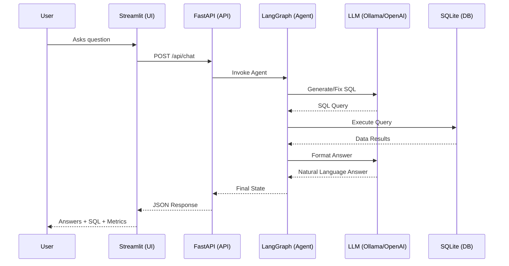
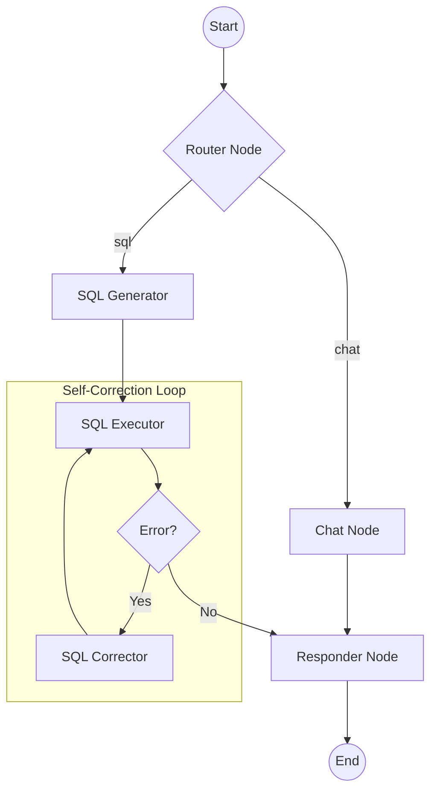

# Inventory Chatbot

A minimal AI chat service designed to answer inventory and business questions from a database. It generates SQL queries locally using LangGraph and Mistral (via Ollama) or OpenAI models.

## 🏗️ System Architecture

### 1. Overall Application Flow



### 2. LangGraph Workflow



## 🚀 Setup & Installation

### 1. Prerequisites

- Python 3.10+
- **Ollama** (if using local Mistral)
- **OpenAI API Key** (if using OpenAI)

### 2. Environment Setup

Create a virtual environment outside the folder:

```powershell
python -m venv ../venv
../venv/Scripts/Activate.ps1
```

Install dependencies:

```powershell
pip install -r requirements.txt
```

### 3. Database Initialization

Ensure the local SQLite database is created and seeded:

```powershell
python setup_database.py
```

### 4. Configuration (.env)

Create a `.env` file in the `inventory-chatbot` folder:

```env
# PROVIDER options: 'ollama' or 'openai'
PROVIDER=ollama
MODEL_NAME=mistral

# If using OpenAI:
# PROVIDER=openai
# MODEL_NAME=gpt-4o
# OPENAI_API_KEY=your_key_here
```

## 🏃 Running the Project

1. **Start the API Server**:

```powershell
python api.py
```

2. **Start the UI (Streamlit)**:

```powershell
python -m streamlit run app.py
```

## 🛠️ Project Structure

- `api.py`: FastAPI server handling the chat endpoint.
- `app.py`: Streamlit UI for interaction and debugging.
- `agent/`:
  - `graph.py`: LangGraph workflow definition.
  - `nodes.py`: Logic for each agent node.
  - `prompts.py`: System prompts and schema handling.
  - `state.py`: Definition of the agent's state.
- `schema.sql`: Database DDL (Source of truth).
- `inventory_chatbot.db`: Local SQLite database.
