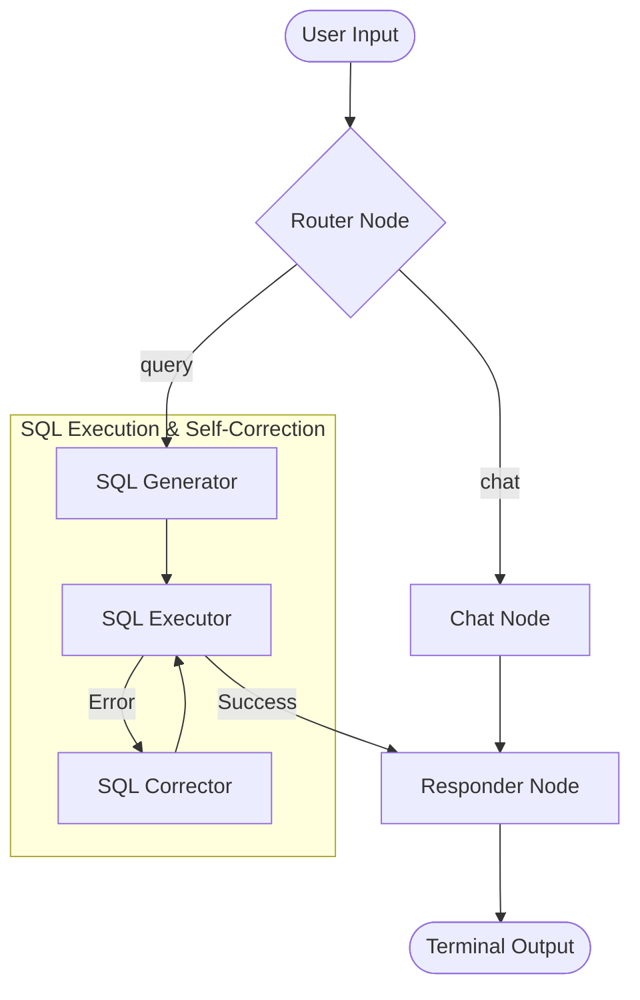

# Architecture Diagrams

## Inventory Chatbot (SQL)

### System Architecture (State Machine)

The SQL bot uses a directed graph (LangGraph) to manage the conversation flow, intent classification, and self-correction logic.

### Key Modules

- **Router Node**: Uses LLM to distinguish between chitchat and database queries.
- **SQL Generator**: Translates natural language into SQLite-compliant SQL, enforcing business rules (Active/Non-Disposed).
- **SQL Executor**: Connects to `inventory_chatbot.db` and retrieves raw results.
- **SQL Corrector**: Analyzes execution errors and re-generates valid SQL.
- **Responder Node**: Synthesizes the final data into a professional natural language report.

### Data & Business Rules

- **Engine**: LangGraph State Machine.
- **Database**: SQLite3.
- **Business Rule 1**: Default to `IsActive = 1` for dimension tables.
- **Business Rule 2**: Exclude `Status IN ('Disposed', 'Retired')` for Assets.
- **Persistence**: Checkpointer handles session thread memory.
