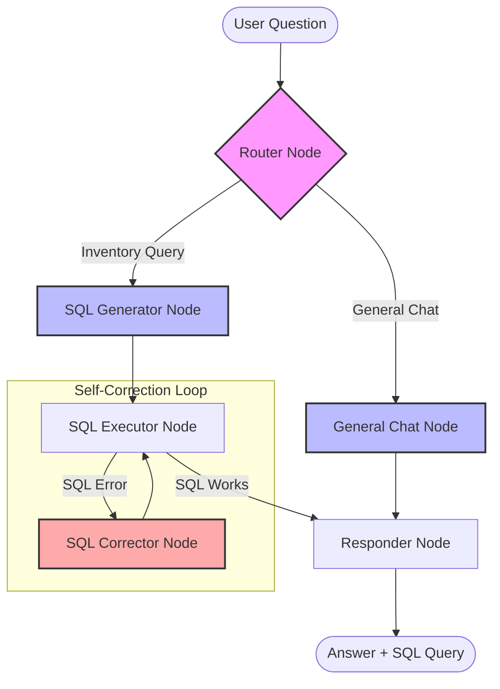

# Inventory Chatbot Workflow

This diagram shows how your request travels through the different "nodes" (specialized AI steps) to get from a question to an answer.

### Explanation of the Flow:

1.  **Router**: Decides if you're asking about the inventory or just saying "Hi".
2.  **General Chat**: Handles non-database questions using Mistral.
3.  **SQL Generator**: Look at the database schema and writes a SQL query.
4.  **SQL Executor**: Tries to run the query on your local SQLite database.
5.  **SQL Corrector**: If the query fails (e.g., wrong column name), it looks at the error and fixes the query.
6.  **Responder**: Takes the data from the database and turns it into a human-friendly answer, making sure to also show you the SQL it used!
