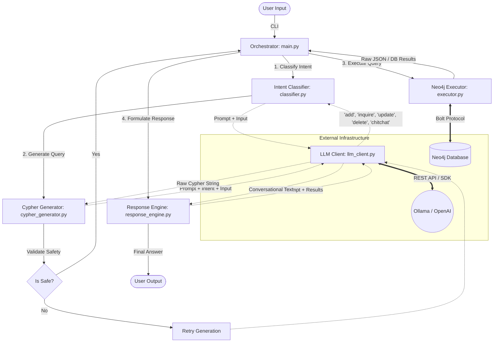

# Neo4j AI Chatbot Architecture

This document outlines the architecture and data flow of the Champions League Football Knowledge Graph Chatbot.

## System Architecture

The chatbot relies on a strict, linear pipeline pattern where user input passes through multiple distinct layers (`Classifier -> Generator -> Executor -> Responder`). This separation of concerns allows for high maintainability, easy testing, and dynamic swapping of the underlying AI provider (Ollama / OpenAI).

---

## Component Details

### 1. Main Orchestrator (`main.py`)

Acts as the entry point and controller of the application. It handles the continuous terminal loop (`while True`), catches runtime exceptions, manages a small rotating memory log, and sequentially passes data between the core modules.

### 2. Intent Classifier (`classifier.py`)

Responsible for reading the raw, unstructured user input and strictly determining the user's goal out of 5 allowed intents:

- `add` (Declarative facts or direct insertions)
- `inquire` (Questions about existing facts)
- `update` (Requests to modify existing relations)
- `delete` (Requests to remove facts/entities)
- `chitchat` (Standard conversational filler)

### 3. Cypher Generator (`cypher_generator.py`)

The most critical part of the LLM logic. It takes the classified intent plus the original user input, and uses strict prompt engineering to force the LLM to write a Cypher query adhering exclusively to the `(Entity)-[:RELATION]->(Value)` schema.

- **Safety Layer:** Includes a basic string analyzer to block malicious queries like `MATCH (n) DETACH DELETE n` or `DROP INDEX`.

### 4. Neo4j Executor (`executor.py`)

A wrapper around the official standard neo4j python driver. Abstracts away connection sessions and runs the generated Cypher query, returning the raw dictionary/array results.

### 5. Response Engine (`response_engine.py`)

Prevents output hallucination by taking the raw database results (e.g., `[{"n2.name": "Inter Miami"}]`) and passing them to the LLM with instructions to specifically formulate a polite, human-readable sentence _out of those results only_.

### 6. Universal LLM Client (`llm_client.py`)

Abstracts away API interactions so that switching between local models (Ollama) and cloud models (OpenAI) takes a single line change in the `.env` file rather than a massive architectural refactoring.
